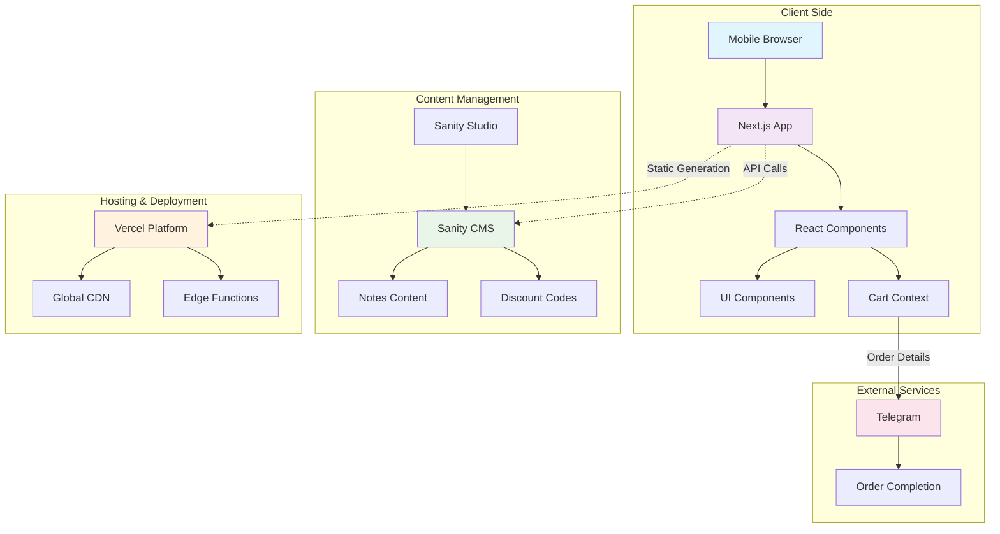
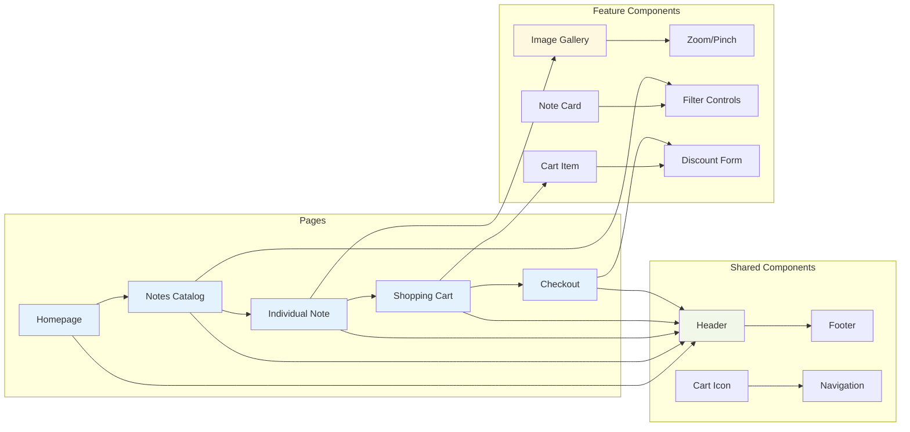
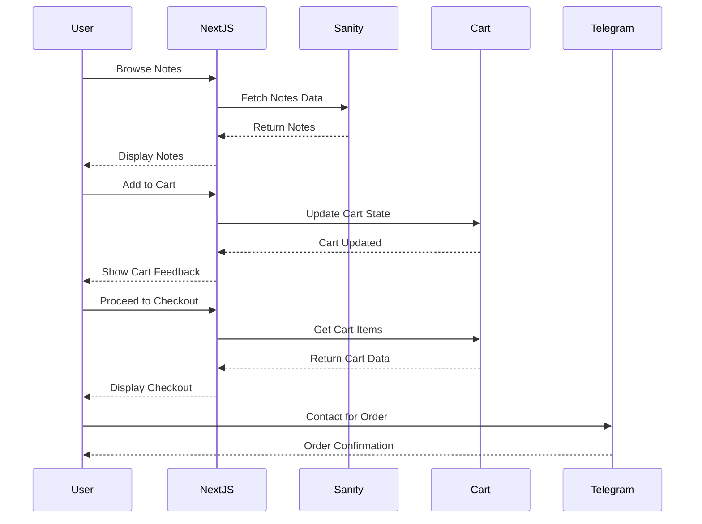
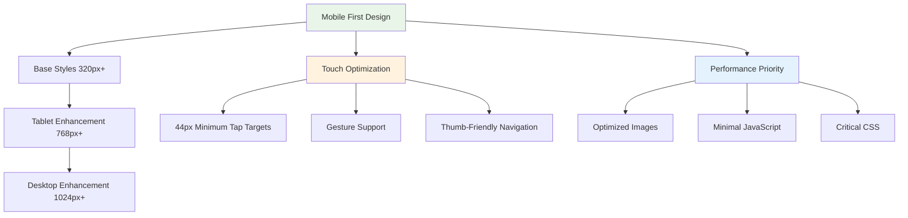

# @Better Notes V2 - Architecture Diagram

## System Architecture Overview



## Component Architecture



## Data Flow Architecture



## Mobile-First Design Strategy



## Technology Stack Integration

```mermaid
graph TB
    subgraph "Frontend Framework"
        A[Next.js 15] --> B[App Router]
        A --> C[Static Site Generation]
        A --> D[Image Optimization]
    end
    
    subgraph "Styling"
        E[Tailwind CSS] --> F[Mobile-First Breakpoints]
        E --> G[Utility Classes]
        E --> H[Custom Theme]
    end
    
    subgraph "Content Management"
        I[Sanity.io] --> J[Headless CMS]
        I --> K[Real-time Updates]
        I --> L[Custom Schemas]
    end
    
    subgraph "State Management"
        M[React Context] --> N[Shopping Cart]
        M --> O[Global State]
    end
    
    subgraph "Image Handling"
        P[react-zoom-pan-pinch] --> Q[Touch Gestures]
        P --> R[Zoom Functionality]
    end
    
    subgraph "Deployment"
        S[Vercel] --> T[Global CDN]
        S --> U[Automatic Deployments]
    end
    
    A --> E
    A --> I
    A --> M
    A --> P
    A --> S
    
    style A fill:#e3f2fd
    style E fill:#f1f8e9
    style I fill:#fff8e1
    style M fill:#fce4ec
    style P fill:#f3e5f5
    style S fill:#e8f5e8
```



## Implementation Phases

```mermaid
gantt
    title @Better Notes V2 Implementation Timeline
    dateFormat  YYYY-MM-DD
    section Phase 1: Foundation
    Project Setup           :done, setup, 2025-11-05, 2d
    Sanity Configuration     :done, sanity, after setup, 2d
    Basic Structure         :done, structure, after sanity, 2d
    
    section Phase 2: Core Pages
    Header/Footer           :active, header, after structure, 2d
    Homepage               :homepage, after header, 3d
    Notes Catalog          :catalog, after homepage, 3d
    
    section Phase 3: Features
    Individual Notes       :notes, after catalog, 3d
    Image Gallery         :gallery, after notes, 2d
    Shopping Cart         :cart, after gallery, 3d
    
    section Phase 4: Integration
    Checkout & Telegram   :checkout, after cart, 2d
    Mobile Optimization   :mobile, after checkout, 3d
    Performance Tuning    :performance, after mobile, 2d
    
    section Phase 5: Launch
    Testing               :testing, after performance, 2d
    Deployment           :deploy, after testing, 1d