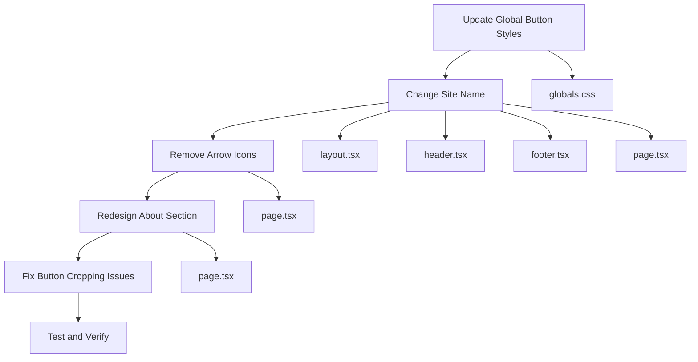

# UI Changes Diagram

## Current State vs. Desired State

### 1. Button Styles

#### Current:
```css
.btn-primary {
  @apply bg-black text-white px-4 py-2 rounded-md font-medium hover:bg-gray-800 transition-colors;
}
```

#### Desired:
```css
.btn-primary {
  @apply bg-black text-white px-6 py-3 rounded-full font-medium hover:bg-gray-800 transition-colors;
}
```

### 2. Site Name Changes

#### Current Locations:
- Header: "Better Notes V2"
- Footer: "Better Notes V2"
- Metadata: "@Better Notes V2 - Premium Medical Notes"
- About Section: "About @Better Notes V2"

#### Desired:
- Header: "Better Notes"
- Footer: "Better Notes"
- Metadata: "@Better Notes - Premium Medical Notes"
- About Section: "About @Better Notes"

### 3. Arrow Icons Removal

#### Current Buttons with Arrows:
```jsx
<Link href="/notes" className="btn-primary text-lg px-6 py-3">
  Browse All Notes
  <ArrowRight className="ml-2 w-5 h-5" />
</Link>
```

#### Desired Buttons:
```jsx
<Link href="/notes" className="btn-primary text-lg px-6 py-3">
  Browse All Notes
</Link>
```

### 4. About Section Redesign

#### Current Structure:
```
┌─────────────────────────────────────┐
│ About @Better Notes V2              │
├─────────────────┬─────────────────┤
│ Placeholder     │ Paragraph text  │
│ image           │ about the app   │
│                 │                 │
│                 │                 │
└─────────────────┴─────────────────┘
```

#### Desired Structure:
```
┌─────────────────────────────────────┐
│ About @Better Notes                 │
├─────────────────────────────────────┤
│                                     │
│     [Profile Image]                  │
│     @Prayas Raj Ojha                │
│                                     │
│  [🏆 Honours in Anatomy]    [🏆 Honours in Community Medicine]  │
│  [🏆 Honours in Microbiology] [🏆 Honours in Pharmacology]       │
│  [🥇 Rank 1 in CMC - 2nd PROF] [🥈 Rank 7 in CMC - FINAL PROF]   │
│                                     │
│     Chittagong Medical College      │
│                                     │
└─────────────────────────────────────┘
```

## Implementation Flow



## Component Impact

### Files to Modify:
1. `betternotes/app/globals.css` - Button styles
2. `betternotes/app/layout.tsx` - Metadata
3. `betternotes/components/layout/header.tsx` - Logo text
4. `betternotes/components/layout/footer.tsx` - Logo and copyright
5. `betternotes/app/page.tsx` - About section and button icons

### Components Affected:
- Header component
- Footer component
- Home page component
- Global button styles

## Testing Strategy

1. **Visual Testing**: Verify all buttons are pill-shaped
2. **Text Testing**: Ensure no "Better Notes V2" instances remain
3. **Icon Testing**: Confirm ArrowRight icons are removed
4. **About Section**: Verify new layout displays correctly
5. **Responsive Testing**: Check all screen sizes
6. **Button Functionality**: Ensure all buttons still work correctly

## Risk Assessment

**Low Risk Changes**:
- Button style updates
- Text changes
- Icon removal

**Medium Risk Changes**:
- About section redesign (requires careful layout testing)

**No Backend Impact**: All changes are purely frontend/UI modifications